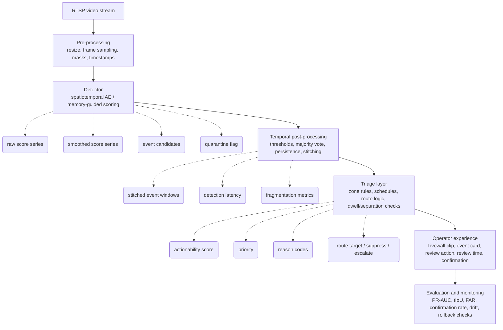

# Video Anomaly Detection Case Study

## Changes & Updates

- [ ] Multimodal Approaches incomplete (Appendix)
- [ ] Jargon cleansing
- [ ] Simplification
- [ ] Hardware costs (on-site, cloud)
- [ ] Dashboards and nudge messaging
- [ ] Practical UX/UI (outputs)

---

# Model-evaluation and incident-diagnosis walkthrough for a self-learning CCTV platform

The document uses two incident tracks throughout.

- **Track A: missed event.** A skateboarder moves quickly through a pedestrian atrium but the system fails to produce one clear control-room alert.
- **Track B: nuisance alert.** Authorised cleaners with reflective trolleys are flagged late at night in a service corridor even though the activity is unusual but operationally routine.

The central idea is that a production VAD problem is almost never solved by “tuning the model” alone. A complete investigation must examine camera readiness, data quality, ground truth, thresholding, temporal aggregation, triage policy, operator workflow, and post-deployment monitoring.

## Evaluation at a glance

### Objective

- Convert Track A from fragmented detection into one operator-usable event.
- Reduce Track B nuisance escalations without masking genuine late-night corridor risks.
- Demonstrate that the revised detector-plus-triage stack is better not only in lab metrics but also in operator burden, routing quality, and production safety.

### Benchmark slices

| **Slice**                                 | **Purpose**        | **Primary incidents**                                                    | **Why it exists**                                                |
| ----------------------------------------- | ------------------ | ------------------------------------------------------------------------ | ---------------------------------------------------------------- |
| `atrium-pedestrian-zone-peak-hours`       | Main Track A slice | Skateboard, running, loitering, trip/fall, delivery                      | Measures missed-event behaviour in dense foot traffic.           |
| `atrium-pedestrian-zone-off-peak`         | Robustness slice   | Low-density normal traffic, maintenance, cleaners                        | Checks whether the fix generalises beyond dense periods.         |
| `service-corridor-late-night-routine-ops` | Main Track B slice | Cleaning, maintenance, trolley movement, intrusion, suspicious loitering | Measures nuisance-alert suppression against true corridor risks. |
| `service-corridor-daytime`                | Context contrast   | Routine staff movement, deliveries, obstructions                         | Prevents overfitting to one corridor time band.                  |
| `held-out-future-window`                  | Final validation   | All operationally relevant events                                        | Tests out-of-time generalisation.                                |

### Core metrics

| **Metric family**  | **Metric**                            | **Primary role**                                            |
| ------------------ | ------------------------------------- | ----------------------------------------------------------- |
| Detection quality  | PR-AUC                                | Rare-event quality under class imbalance.                   |
| Detection quality  | Event-level precision / recall / F1   | Whole-incident detection quality.                           |
| Localisation       | tIoU                                  | Start/end window quality for operator-usable events.        |
| Timing             | Detection latency                     | Time from event onset to surfaced event.                    |
| Operational burden | FAR per 100 hours                     | Real-world false-alert cost.                                |
| Operational trust  | Operator confirmation rate            | Whether surfaced alerts are believed and useful.            |
| Workflow           | Median review time                    | Screen-fatigue and triage efficiency signal.                |
| Stability          | Fragmentation index, drift indicators | Detects Track A-type splitting and longer-term degradation. |

### Pass/fail gates

| **Gate**               | **Minimum requirement**                                                             | **Failure meaning**                                              |
| ---------------------- | ----------------------------------------------------------------------------------- | ---------------------------------------------------------------- |
| Track A localisation   | tIoU at or above 0.50 on accepted events                                            | The system still fails to package the incident coherently.       |
| Track A coherence      | Fragmentation index materially reduced versus baseline                              | The system still splits one event into many fragments.           |
| Track B burden         | FAR per 100 hours materially reduced on late-night corridor slice                   | Operators still absorb nuisance load.                            |
| Track B safety         | No unacceptable recall collapse on true corridor intrusions or suspicious loitering | Triage became too aggressive.                                    |
| Holdout generalisation | No critical regression on held-out future window                                    | Improvement may be overfit to the debug slice.                   |
| Operational usability  | Median review time and confirmation rate improve                                    | The system may be mathematically better but operationally worse. |

### Rollout decision rubric

![[Pasted image 20260608144226.png]]

| **Decision**                    | **Condition**                                                                                                                    |
| ------------------------------- | -------------------------------------------------------------------------------------------------------------------------------- |
| **Approve for shadow mode**     | Offline replay passes Track A and Track B gates; no critical regression on adjacent slices.                                      |
| **Approve limited live cohort** | Shadow mode confirms stable burden, safe suppression, and acceptable drift behaviour.                                            |
| **Expand rollout**              | Two-week cohort results sustain gains in confirmation rate, review time, and nuisance reduction.                                 |
| **Rollback**                    | Miss on known true incident, major false-positive spike, suppression of true critical event, or unresolved camera-drift failure. |

## Evaluation Flow

camera feed → detect → stabilise → triage → operator → evaluate/monitor → rollout or rollback

```beautiful-mermaid
flowchart TD
    A[Evaluation at a glance<br/>objective, slices, metrics, pass/fail gates] --> B[Incident observed and scoped<br/>define Track A or Track B, scope the operational problem]
    B --> C[Stage 1: site and camera readiness audit<br/>confirm field of view, stream quality, stability]
    C --> D[Stage 2: incident card creation<br/>record clip, event window, scores, thresholds, operator outcome]
    D --> E[Stage 3: failure typing<br/>true miss, fragmented event, nuisance alert, routing failure, contamination]

    E --> F[Step 1: problem statement and success criteria<br/>state measurable success conditions]
    F --> G[Step 2: data freeze and version control<br/>freeze clips, labels, versions, partitions]
    G --> H[Benchmark design<br/>define slices, holdout windows, and accounting]
    H --> I[Annotation protocol<br/>define event boundaries, adjudication, and artefacts]

    I --> J[Model under test<br/>document detector, memory, post-processing, and quarantine]
    J --> K[Baseline vs revised system boundary<br/>separate deployed baseline from proposed stack]
    K --> L[Step 4-6: baseline reproduction, output capture, and diagnostics<br/>reproduce baseline and inspect scores, events, and operator outcomes]

    L --> M[Explicit event-matching protocol<br/>pair predictions to ground truth with tIoU rules]
    M --> N[Step 7-9: remedy design, implementation, calibration<br/>apply fixes and set thresholds]
    N --> O[Step 10-13: metrics, statistics, ablation, failure analysis<br/>measure quality, burden, stability, and error types]

    O --> P[Step 14: offline replay evaluation]
    P --> Q{Pass offline gates?}
    Q -- No --> N
    Q -- Yes --> R[Step 15: shadow-mode evaluation]

    R --> S{Shadow mode acceptable?}
    S -- No --> N
    S -- Yes --> T[Step 16: limited live cohort]

    T --> U{Cohort gains sustained?}
    U -- No --> V[Rollback or adjust<br/>camera setup, thresholds, post-processing, or triage]
    U -- Yes --> W[Production monitoring design<br/>drift, quarantine health, load, suppression safety]

    W --> X[Documentation package required for sign-off<br/>artefacts, evidence, decision memo]
    X --> Y[Expand rollout with rollback triggers]
```

## System under evaluation

The operating stack is separated into layers because failures often occur at the boundary between them.

| **Layer**                      | **Function in the stack**                                                              | **Primary evaluation concern**                                     |
| ------------------------------ | -------------------------------------------------------------------------------------- | ------------------------------------------------------------------ |
| Safety and Security / core VAD | Learns camera-specific normal behaviour and scores deviations from normal.             | Detection quality, temporal stability, robustness to drift.        |
| Livewall / event presentation  | Surfaces condensed clips to operators instead of full continuous footage.              | Event stitching quality, review usability, latency.                |
| Triage Agent / policy layer    | Converts unusual events into operational actions using site context and rules.         | Precision of escalation, explanation quality, routing correctness. |
| Analytics                      | Provides occupancy, flow, dwell, and movement context.                                 | Context quality, covariate monitoring, operational interpretation. |
| Forensic Quick Find            | Supports post-event tracking across cameras.                                           | Investigation utility, incident linkage.                           |
| Optional identity layer        | Supports allow/deny watchlists and identity workflows outside the core anomaly engine. | Governance, privacy, policy separation.                            |

The anomaly engine answers: **Is this unusual for this camera, zone, and time pattern?**

The triage layer answers: **Is this unusual event operationally actionable, who should see it, at what priority, and with what explanation?**

That distinction is mandatory for proper evaluation. Track B is not primarily a failure of anomaly recognition. It is primarily a failure to distinguish unusual from actionable.

## Visual exhibits

### Exhibit 1: score timeline and event stitching

This exhibit shows why Track A is not treated as a pure model-blindness problem. The baseline score already contains useful evidence, but it is fragmented and therefore fails the operator.

![[Pasted image 20260608144547.png]]

![[Pasted image 20260608143534.png]]

### Exhibit 2: incident decision flow

This exhibit makes the diagnosis path explicit so incident reviews do not jump from “system failed” straight to “change the model.”

```beautiful-mermaid
flowchart TD
    A[Incident observed] --> B[Create canonical incident card]
    B --> C{Camera and stream readiness audit}

    C -- fail --> D[Remediate camera / reset / relearn / stop model blame]
    C -- pass --> E[Reproduce baseline outputs]

    E --> F[Inspect score timeline, event windows, triage decision, operator outcome]
    F --> G{Classify primary failure}

    G -- true miss --> H[Scoring / threshold / representation review]
    G -- fragmented event --> I[Smoothing / persistence / stitching review]
    G -- nuisance alert --> J[Triage / schedule / route / zone review]
    G -- routing failure --> K[Queue / Livewall / notification workflow review]
    G -- contamination --> L[Online learning / quarantine / memory update review]

    H --> M[Offline replay]
    I --> M
    J --> M
    K --> M
    L --> M

    M --> N[Shadow mode]
    N --> O[Limited cohort]
    O --> P[Rollout / rollback]
```

### Exhibit 3: detector-to-triage-to-operator schema

This exhibit separates what the model outputs from what the operational stack decides.



## Evaluation principles

The evaluation program follows ten rules.

1. **Inspect the camera and stream before inspecting the model.** A poor viewpoint, unstable feed, or changed lens can invalidate downstream conclusions.
2. **Separate detection failure from escalation failure.** The model may have noticed something unusual while the stack still failed the operator.
3. **Evaluate at event level as well as frame level.** Operators act on events, not isolated score spikes.
4. **Treat ground truth as an operational artefact, not only a machine-learning artefact.** Operator-confirmed outcomes, review logs, and incident windows matter.
5. **Record all intermediate values.** Raw scores, smoothed scores, thresholds, persistence checks, and triage reasons must be preserved.
6. **Use out-of-time holdouts.** Improvements must generalise to future footage rather than only fit the analysed clips.
7. **Distinguish detector outputs from decision outputs.** Model outputs and policy outputs must not be conflated.
8. **Defend every threshold and rule.** Thresholds must have calibration evidence and operating rationale.
9. **Require ablation evidence.** Each added component must demonstrate incremental value.
10. **Treat deployment as an experiment with rollback conditions.** A lab win is not a production win until monitored safely.

## Incident observed and scoped

Every investigation begins by scoping the operational problem before technical diagnosis starts.

- Identify whether the case is a missed event, nuisance alert, routing failure, or another operational concern.
- Name the primary camera, zone, time band, and affected operator workflow.
- State why the incident matters operationally, such as safety risk, nuisance burden, or escalation failure.
- Assign the case to the relevant evaluation track, such as Track A or Track B in this document.
- Record the initial hypothesis as provisional only; the purpose of later stages is to test it rather than assume it.

This scoping step prevents the investigation from jumping directly from one anecdotal clip to model changes without first defining the actual evaluation target.

## Incident definitions

### Track A: missed skateboarder

A fast-moving skateboarder passes through a pedestrian atrium, weaving near other people and creating a genuine safety risk. The platform does not raise one clear, unified control-room alert in time for an operator to act.

The preliminary hypothesis is not “the model is blind.” The working hypothesis is **fragmented event detection**: the model generates short bursts of anomaly score, but temporal instability prevents a single usable event from being escalated.

![[Pasted image 20260608143559.png]]

### Track B: nuisance cleaning alert

Two authorised cleaners push reflective trolleys during a late-night service window in a corridor near a loading area. The platform flags the activity as unusual and sends an alert that is later dismissed by the operator.

The preliminary hypothesis is not “the detector is wrong to see something unusual.” The working hypothesis is **triage failure**: the unusual motion is real relative to the corridor’s learned baseline, but it is not operationally important given the site context.

![[Pasted image 20260608143615.png]]

## Full incident-diagnosis workflow

The following workflow is the minimum professional process for diagnosing a VAD incident and any proposed fix.

### Stage 1: site and camera readiness audit

Before analysing scores or metrics, confirm that the camera can physically support the target detection task.

**Inputs inspected**

- Camera ID, make, model, lens, mounting height, angle, zoom, and any recent maintenance record.
- RTSP settings, actual delivered frame rate, resolution, compression profile, GOP structure, timestamp integrity, and dropped-frame indicators.
- Lighting conditions by time band, reflective surfaces, glare, seasonal variation, signage, shadows, and repeated environmental artefacts.
- Field of view coverage for the event type of interest, including entry and exit zones.
- Whether the camera moved, zoom changed, or occlusions were introduced after the learning period began.

**Outputs recorded**

- Camera readiness status: pass, conditional pass, or fail.
- A camera audit note with photos or annotated snapshots if available.
- Required remediation actions such as reset, relearn, repositioning, exposure change, or exclusion from model diagnosis.

**Diagnostic questions**

- Is the event visible long enough for a stable temporal signature?
- Does the scene geometry flatten movement or hide direction changes?
- Are people or vehicles too small or too large in the frame for stable learning?
- Are repeated reflections creating false motion residuals?
- Is the effective frame rate too low for short high-speed actions such as skating or running?

A failed camera-readiness audit blocks downstream claims about model quality. If the camera is not fit for purpose, the correct conclusion is not model failure.

### Stage 2: incident card creation

Every investigated incident must have a single canonical incident card. No investigation should proceed from memory or loosely shared clips.

#### ==Incident card schema==

| **Field group** | **Field**               | **Description**                                                                  |
| --------------- | ----------------------- | -------------------------------------------------------------------------------- |
| Identity        | Incident ID             | Unique identifier for traceability.                                              |
| Identity        | Site ID                 | Site where the event occurred.                                                   |
| Identity        | Camera ID               | Specific video stream under evaluation.                                          |
| Timing          | Event date              | Calendar date of event.                                                          |
| Timing          | Event time              | Local time and timezone.                                                         |
| Timing          | Clip start/end          | Exact extracted review window.                                                   |
| Timing          | Event window start/end  | Annotated start and end of the true event.                                       |
| Human outcome   | Label                   | Missed event, true positive, false positive, near miss, routed late, or unknown. |
| Detection       | Raw score series        | Frame or segment anomaly scores before smoothing.                                |
| Detection       | Smoothed score series   | Scores after temporal refinement.                                                |
| Detection       | Detector threshold      | Threshold active at the time of the incident.                                    |
| Detection       | Persistence rule result | Whether minimum duration criteria were met.                                      |
| Detection       | Event stitch result     | How fragments were merged or split.                                              |
| Triage          | Priority                | Alert priority assigned by policy layer.                                         |
| Triage          | Explanation             | Plain-language summary or reason code.                                           |
| Triage          | Routed team             | Destination queue, operator, or automation channel.                              |
| Triage          | Escalation decision     | Escalated, suppressed, down-ranked, or logged only.                              |
| Operator        | Operator action         | Confirmed, dismissed, ignored, escalated further, or unresolved.                 |
| Operator        | Review time             | Seconds to dismiss or act.                                                       |
| Evidence        | Clip URI                | Link or storage key for audited clip.                                            |
| Evidence        | Snapshot set            | Any stills used in the investigation.                                            |
| Evidence        | Change history          | Whether camera, threshold, or model changed near the incident.                   |

#### Required attachments to the incident card

- Video clip with at least 30 to 60 seconds before and after the event.
- Score timeline plot over the review window.
- Event annotation file with exact window boundaries.
- Operator review log.
- Camera readiness note.
- Threshold and model version active at event time.
- Triage rule set version active at event time.

### Stage 3: failure typing

The investigation must classify the primary failure mode before selecting a remedy.

| **Failure type**                | **Definition**                                                       | **Typical evidence**                                                          | **Typical remedy**                                                       |
| ------------------------------- | -------------------------------------------------------------------- | ----------------------------------------------------------------------------- | ------------------------------------------------------------------------ |
| True miss                       | Score never rises enough to detect the event.                        | Flat or weak score during true event window.                                  | Improve feature learning, representation, or threshold sensitivity.      |
| Fragmented event                | Score rises in bursts but does not form one continuous usable event. | Alternating spikes and dips around event window; low event overlap.           | Temporal smoothing, majority voting, persistence rules, event stitching. |
| Nuisance alert                  | Unusual behaviour is detected but is not operationally meaningful.   | High score for routine but rare activities; low confirmation rate.            | Triage context, schedule-aware policy, rule-based down-ranking.          |
| Routing or presentation failure | Event is detected but delivered poorly or to the wrong place.        | Event exists in logs but not seen, seen late, or shown as multiple fragments. | Workflow, UI, routing, prioritisation, alert bundling.                   |
| Learning contamination          | Anomalous or hazardous behaviour is absorbed into “normal”.          | Shrinking score over recurring hazard or persistent abnormal state.           | Quarantine buffer, guarded updates, reset and relearn controls.          |

For this case study:

- Track A is primarily **fragmented event**, with possible secondary contribution from camera geometry or threshold policy.
- Track B is primarily **nuisance alert**, with secondary contribution from insufficient contextual triage.

## Model under test

### Detection objective

The detector is an unsupervised or self-learning spatiotemporal anomaly detector trained predominantly on normal footage. It estimates how poorly current video patterns conform to learned normal behaviour for a specific camera or camera class.

### Input tensor definition

The detector ingests short spatiotemporal blocks:

$$X \in \mathbb{R}^{C \times T \times H \times W}$$

with example settings:

- $C = 3$ RGB channels.
- $T = 8$ frames per cliplet.
- $H = 16$.
- $W = 16$.

This yields $3 \times 8 \times 16 \times 16 = 6144$ values per patch before latent compression.

### Baseline scoring function

The baseline anomaly score is the reconstruction error:

$$E = \lVert x - \hat{x} \rVert_2^2$$

where $x$ is the input representation and $\hat{x}$ is the reconstruction. Low error implies good match to learned normality. High error implies poor match.

### Memory-augmented variant

To reduce the tendency of a plain autoencoder to reconstruct abnormal inputs too well, the model uses a memory-guided design. The encoder maps the input to a latent query vector:

$$q \in \mathbb{R}^{d}$$

with example latent dimension $d = 512$.

The memory bank is:

$$M \in \mathbb{R}^{N \times d}$$

with example size $N = 2048$.

Memory attention weights are computed as:

$$w_i = \frac{\exp(\cos(q,m_i))}{\sum_{j=1}^{N} \exp(\cos(q,m_j))}$$

and reconstruction is formed by:

$$\hat{x} = \text{Decoder}(w^T M)$$

The interpretation is operationally important:

- A normal pattern tends to match one or a few memory prototypes strongly.
- An anomalous pattern tends to match weakly and diffusely, producing a blurrier reconstruction and a higher error.

### Online adaptation and quarantine

The deployment supports guarded online adaptation. Only sustained low-error patterns are eligible to update memory. High-error or suspicious patterns are held in a quarantine buffer until they are verified or disappear.

This prevents long-duration hazards such as spillages, abandoned objects, or blocked paths from becoming “normal” merely because they persist in view.

## Baseline vs revised system boundary

This section makes the comparison boundary explicit so the case study does not blur the currently deployed system with the proposed evaluated stack.

### Baseline system

The baseline system is the deployed reference configuration used for reproduction and comparison. It includes the production pre-processing path, detector configuration, threshold settings, temporal post-processing rules, event stitching behaviour, and triage policy that were active at the time of the investigated incidents.

### Revised system

The revised system is the proposed stack evaluated against the same frozen benchmark and later rollout stages. In this case study it includes memory-guided anomaly scoring, temporal refinement, decision stabilisation, and context-aware triage as defined in the implementation section.

### ==Boundary rules==

1. Do not compare baseline and revised results unless data partitions, annotation version, and timestamp basis are held constant.
2. Do not attribute improvements to the detector alone if post-processing or triage changed.
3. Report which outputs belong to the detector, which belong to temporal post-processing, and which belong to triage.
4. Keep rollback decisions tied to the full revised stack unless an ablation isolates a single component safely.

### Why this boundary matters

Track A and Track B are stack-level problems, not detector-only problems. A valid evaluation must show whether gains came from anomaly scoring, temporal packaging, triage policy, or the interaction between them.

## Complete input specification for evaluation

Evaluation is only reproducible if every input class is named explicitly.

### A. Video inputs

- Raw video streams or archived clips.
- Frame timestamps and source time synchronisation status.
- Camera metadata.
- Zone masks if the detector or policy restricts areas of interest.
- Environmental metadata such as day/night or weather where applicable.

### B. Annotation inputs

- Event start and end timestamps for every labelled incident.
- Class or tag labels where used, such as skateboard, running, cleaning, loitering, intrusion, trip, unknown.
- Annotation confidence level.
- Annotator identifier.
- Adjudication result where multiple annotators disagree.

### C. Operational inputs

- Operator confirmation or dismissal logs.
- Alert delivery logs, queue destinations, acknowledgement time, and review time.
- Shift schedule and staffing level when incident occurred.
- Site schedules such as cleaning, contractor, maintenance, or loading windows.

### D. Model and policy inputs

- Model version hash.
- Training window dates.
- Training footage inclusion and exclusion rules.
- Threshold configuration and calibration date.
- Temporal smoothing parameters.
- Majority vote window and persistence duration.
- Triage ruleset version and all active policy conditions.
- Camera-class configuration if thresholds or models differ by class.

### E. Audit inputs

- Camera movement or maintenance history.
- Known outages, frame drops, or quality degradation events.
- Prior incidents on the same camera.
- Drift statistics leading up to the incident.

## Complete output specification for evaluation

A professional case study must define the full set of outputs returned by each layer.

### ==A. Detector outputs==

| **Output**                 | **Type**                | **Description**                                                        |
| -------------------------- | ----------------------- | ---------------------------------------------------------------------- |
| `score_raw[t]`             | Numeric time series     | Raw anomaly score per frame or segment.                                |
| `score_smooth[t]`          | Numeric time series     | Temporally refined score after smoothing.                              |
| `threshold[t]`             | Numeric value or series | Active threshold applied to this camera/time band.                     |
| `is_anomalous[t]`          | Binary series           | Whether each frame or segment exceeds threshold after post-processing. |
| `persistence_count[t]`     | Integer series          | Consecutive anomalous frames or segments.                              |
| `event_candidates`         | Structured list         | Candidate event windows before final stitching.                        |
| `event_stitched`           | Structured list         | Final event windows sent downstream.                                   |
| `reconstruction_error`     | Numeric                 | Error statistic used as anomaly score.                                 |
| `memory_attention_summary` | Vector summary          | Concentration statistics for memory usage, useful for diagnostics.     |
| `quarantine_flag`          | Boolean                 | Whether the pattern was blocked from memory update.                    |

### B. Triage outputs

| **Output**              | **Type**          | **Description**                                                     |
| ----------------------- | ----------------- | ------------------------------------------------------------------- |
| `priority`              | Categorical       | Informational, low, medium, high, critical.                         |
| `actionability_score`   | Numeric           | Policy-level score estimating operational importance.               |
| `reason_codes`          | List              | Why the event was promoted, suppressed, or down-ranked.             |
| `site_context_features` | Structured record | Time band, zone type, scheduled activity flags, and route patterns. |
| `route_target`          | Categorical       | Control room, guard patrol, manager, API, silent log.               |
| `escalation_status`     | Categorical       | Escalated, suppressed, down-ranked, merged, or deferred.            |
| `explanation_text`      | Text              | Plain-language summary for operators.                               |

### C. Operator-facing outputs

| **Output**          | **Type**    | **Description**                                       |
| ------------------- | ----------- | ----------------------------------------------------- |
| Review clip         | Video clip  | Condensed incident clip shown to operator.            |
| Event card          | UI object   | Headline incident summary.                            |
| Confirmation result | Categorical | Confirmed, dismissed, needs review, unresolved.       |
| Review time         | Numeric     | Seconds to act or dismiss.                            |
| Follow-up action    | Categorical | Notify, dispatch, ignore, create report, investigate. |

### D. Evaluation outputs

| **Output**                 | **Type**      | **Description**                                                            |
| -------------------------- | ------------- | -------------------------------------------------------------------------- |
| PR-AUC                     | Metric        | Precision-recall area under curve.                                         |
| ROC-AUC                    | Metric        | Receiver operating characteristic AUC; retained but not used alone.        |
| Event-level precision      | Metric        | Fraction of predicted events that are correct.                             |
| Event-level recall         | Metric        | Fraction of true events that are caught.                                   |
| Event-level F1             | Metric        | Harmonic mean of event precision and recall.                               |
| tIoU                       | Metric        | Temporal intersection-over-union between predicted and true event windows. |
| FAR per 100 hours          | Metric        | False alarm burden normalised by footage duration.                         |
| Operator confirmation rate | Metric        | Share of escalated alerts confirmed by operators.                          |
| Median review time         | Metric        | Operational review burden.                                                 |
| Detection latency          | Metric        | Delay from event onset to alert availability.                              |
| Calibration error          | Metric        | Agreement between predicted risk and observed frequency where applicable.  |
| Drift indicators           | Metric family | Distribution shifts by camera, slice, or time band.                        |

## Benchmark design

### Slice construction principles

Benchmarking must mirror the real deployment instead of relying on a generic public dataset alone.

**Mandatory slice rules**

- Partition by camera class, zone type, and time band.
- Include normal routine footage and rare edge cases.
- Use operator-confirmed outcomes whenever possible.
- Hold out later footage for out-of-time testing.
- Prevent leakage across training, calibration, and test windows.

### Recommended slices for this case study

| **Slice name**                            | **Primary use**            | **Mandatory labels**                                                          |
| ----------------------------------------- | -------------------------- | ----------------------------------------------------------------------------- |
| `atrium-pedestrian-zone-peak-hours`       | Track A evaluation         | Normal walking, running, skateboard, delivery, loitering, trip/fall, unknown. |
| `atrium-pedestrian-zone-off-peak`         | Robustness check           | Low-density normal traffic, cleaners, maintenance, unknown.                   |
| `service-corridor-late-night-routine-ops` | Track B evaluation         | Cleaning, delivery, maintenance, suspicious loitering, intrusion, unknown.    |
| `service-corridor-daytime`                | Drift and context contrast | Routine staff movement, deliveries, transient obstructions.                   |
| `held-out-future-window`                  | Out-of-time generalisation | All operationally relevant classes.                                           |

### Dataset accounting template

Every evaluation report should declare at minimum:

- Number of cameras per slice.
- Number of hours of footage per slice.
- Number of labelled anomalous events per slice.
- Number of routine but unusual operational events per slice.
- Time period covered by training, validation, calibration, and holdout windows.
- Annotation source and adjudication procedure.
- Inclusion and exclusion criteria for clips.

Without these details, reported improvements are not reproducible and may hide leakage or sampling bias.

## Annotation protocol

### Ground-truth levels

Ground truth exists at three levels and must not be collapsed into one field.

1. **Frame or segment level.** Optional, used for temporal fidelity analysis.
2. **Event level.** Mandatory, used for event detection and tIoU.
3. **Operational outcome level.** Mandatory, used for confirmation rate, review burden, and route quality.

### Annotation rules

- An event begins when behaviour first becomes operationally abnormal, not merely when an object enters frame.
- An event ends when the abnormal behaviour ceases or becomes clearly routine again.
- For Track B, the event may still be tagged “unusual” while also tagged “authorised routine” to support triage analysis.
- Ambiguous incidents must be marked as unresolved until adjudicated.
- Two annotators should independently label a subset sufficient to estimate agreement.
- Adjudication notes must explain disagreements that affect event boundaries or actionability.

### Recommended annotation artefacts

- Event window JSON or CSV.
- Optional frame-level binary mask or segment labels.
- Reason-code taxonomy for dismissals and confirmations.
- Adjudication log.
- Slice membership file.

## Explicit event-matching protocol

This section defines exactly how predicted events are matched to ground truth during event-level evaluation. Without this protocol, reported event precision, recall, F1, and tIoU may vary simply because different reviewers matched events differently.

### Matching unit

The primary evaluation unit is the **post-stitched event window** emitted after smoothing, thresholding, persistence, and stitching. Pre-stitched candidate fragments are retained for diagnostics but are not the primary unit for headline event metrics.

### Definitions

For each clip or continuous evaluation window on one camera:

- Let $G = \{g_1, g_2, ..., g_m\}$ be the set of ground-truth event windows.
- Let $P = \{p_1, p_2, ..., p_n\}$ be the set of predicted post-stitched event windows.
- For any ground-truth/prediction pair, compute temporal intersection-over-union:

$$\text{tIoU}(g_i, p_j) = \frac{|g_i \cap p_j|}{|g_i \cup p_j|}$$

### Primary matching rule

1. Compute all candidate $(g_i, p_j)$ pairs on the same camera and clip.
2. Discard pairs with no temporal overlap.
3. Sort remaining pairs by descending tIoU.
4. Apply greedy one-to-one matching in that order.
5. A matched pair is a **true positive event** only if tIoU is at or above the acceptance threshold.
6. Any unmatched ground-truth event is a **false negative**.
7. Any unmatched predicted event is a **false positive**.

### Minimum tIoU rule

The primary acceptance threshold is:

- **tIoU >= 0.50** for the main event-level analysis.

Recommended sensitivity analysis:

- Report secondary analyses at **tIoU >= 0.30** and **tIoU >= 0.70**.
- Use 0.30 to assess lenient capture of operationally relevant events.
- Use 0.70 to assess strict temporal bracketing quality.

The rollout gate should be based on the 0.50 threshold unless the operating context requires otherwise.

### Handling one-to-many fragments

A common VAD failure occurs when one true event is broken into multiple predicted fragments.

#### Primary rule for headline metrics

- Only **one** predicted event can match a given ground-truth event in the one-to-one event metric.
- If multiple predicted events overlap the same ground-truth event, only the highest-tIoU eligible prediction may become the match.
- The remaining overlapping fragments count as **false-positive fragments** for event precision.

#### Diagnostic fragmentation rule

To avoid hiding this failure mode, the evaluation must also report:

- **Fragmentation index** = number of predicted fragments overlapping a single ground-truth event before final stitching.
- **Fragmented miss flag** = a ground-truth event where no single post-stitched event reaches the minimum tIoU threshold, but two or more overlapping fragments collectively indicate partial detection.

This means the case study distinguishes three outcomes that might otherwise be collapsed:

1. **Clean hit** — one matched predicted event with acceptable tIoU.
2. **Fragmented hit with penalty** — one matched event exists, but extra overlapping fragments remain and harm precision.
3. **Fragmented miss** — evidence exists in pieces, but no valid one-to-one event meets the tIoU criterion.

### Handling many-to-one predictions

If one predicted event overlaps multiple ground-truth events:

- Only one ground-truth event may be matched in the primary one-to-one metric.
- Additional overlapped ground-truth events remain false negatives.
- Such cases should be tagged as **over-merged predictions** in error analysis.

### Boundary tolerance and timestamp policy

To keep evaluations fair and reproducible:

- Use the same timestamp basis for annotations and model outputs.
- State whether times are frame-accurate or segment-based.
- If segmentation or low frame rate introduces unavoidable quantisation error, record the effective time resolution.
- Apply a documented boundary tolerance only if operationally justified, and keep it constant across baseline and revised systems.

### Outputs required from matching

The matcher must produce, for every evaluated clip:

- Ground-truth event list.
- Predicted event list.
- Pairwise tIoU matrix.
- Final matched pairs.
- False positives and false negatives.
- Fragmentation index per ground-truth event.
- Over-merged prediction flags.
- Summary counts for event precision, recall, F1, and mean or median tIoU on matched events.

## Full evaluation pipeline

The pipeline below is the required walk-through from raw footage to signed-off production decision.

### Step 1: problem statement and success criteria

State the operational problem in measurable terms.

**Track A success criteria**

- The skateboarder incident is surfaced as one continuous event.
- Event-level recall improves without materially increasing nuisance alerts in the atrium.
- tIoU exceeds the minimum acceptance threshold.
- Detection latency stays within the response requirement.

**Track B success criteria**

- Cleaning trolley alerts are reduced or down-ranked substantially.
- Precision improves in the late-night service corridor.
- Recall for genuine intrusions, suspicious loitering, or unsafe corridor activity does not collapse.
- Operator review time falls to the target range.

### Step 2: data freeze and version control

Freeze the evaluation data before experimentation.

Record:

- Data extraction date.
- Exact clip inventory.
- Training, validation, calibration, and test partitions.
- Annotation version.
- Model version.
- Triage ruleset version.

No metric should be reported without this versioning information.

### Step 3: camera-readiness review

Perform the audit described earlier and remove or separately flag cameras that fail readiness checks. This step prevents invalid comparisons between “before” and “after” where the feed quality, angle, or scene geometry changed.

### Step 4: baseline reproduction

Reproduce the currently deployed baseline exactly.

Required records:

- Pre-processing settings.
- Feature extraction path.
- Model weights or checkpoint.
- Thresholds.
- Smoothing rules.
- Event stitching rules.
- Triage policy and routing logic.

If the baseline cannot be reproduced exactly, no valid comparison exists.

### Step 5: baseline output capture

Run the baseline on the frozen benchmark and store all intermediate outputs.

Mandatory retained artefacts:

- Raw score series for every evaluated clip.
- Smoothed score series.
- Binary anomaly decisions by time step.
- Event candidate list.
- Final stitched events.
- Triage reason codes and route targets.
- Operator-facing event cards where relevant.

### Step 6: exploratory diagnostic review

This step identifies likely failure mechanisms before new modelling work.

Inspect at least:

- Score timelines over true event windows.
- Histograms of normal versus anomalous score distributions.
- Per-camera threshold hit rates.
- Event fragmentation statistics.
- Detection latency distributions.
- False-positive clusters by time band and zone.
- Operator dismissal reasons.
- Drift indicators in the period preceding the incident.

For Track A, diagnostic attention is on fragmentation and latency. For Track B, diagnostic attention is on time-band context, routine operations, and dismissal rationale.

### Step 7: remedy design and hypothesis table

Each proposed change must correspond to a diagnosed mechanism.

| **Diagnosed issue**                            | **Proposed intervention**               | **Expected effect**                                       | **Primary metric**                | **Risk**                                       |
| ---------------------------------------------- | --------------------------------------- | --------------------------------------------------------- | --------------------------------- | ---------------------------------------------- |
| Fragmented score spikes in Track A             | Gaussian smoothing and event stitching  | Convert bursty spikes into one coherent event             | tIoU, event recall                | Excess smoothing may merge unrelated events.   |
| Short spikes crossing threshold inconsistently | Majority voting and minimum persistence | Suppress transient noise and preserve sustained anomalies | FAR, event precision              | May hurt recall for very short true anomalies. |
| Plain AE reconstructs anomalies too well       | Memory-guided reconstruction            | Increase separation between normal and anomalous patterns | PR-AUC, score separation          | Memory collapse or poor prototype diversity.   |
| Routine cleaning escalated as important        | Context-aware triage                    | Reduce false escalations in service corridor              | Precision, confirmation rate      | Under-escalation of rare true corridor risks.  |
| Potential contamination during online updates  | Quarantine buffer                       | Protect normal memory bank from hazards                   | Drift stability, recall over time | Slower adaptation to benign shifts.            |

### Step 8: implementation under evaluation

The revised evaluated stack includes four changes.

1. **Memory-guided anomaly scoring** to improve abnormal-versus-normal separation.
2. **Temporal refinement** using Gaussian smoothing.
3. **Decision stabilisation** using majority voting and minimum persistence.
4. **Context-aware triage** to separate unusual from actionable.

#### Temporal refinement details

Given raw scores:

$$E_{raw} = [0.12, 0.87, 0.14, 0.91, 0.11]$$

apply Gaussian smoothing:

$$E_t^{smooth} = \sum_{k=-K}^{K} E_{t-k} \cdot \frac{1}{\sqrt{2\pi\sigma^2}} \exp\left(-\frac{k^2}{2\sigma^2}\right)$$

with example parameters:

- $\sigma = 2.0$
- 15-frame window

A stabilised output may resemble:

$$E_{smooth} = [0.55, 0.61, 0.64, 0.62, 0.58]$$

This converts fragmented evidence into a continuous event candidate.

#### Decision rules

- **Thresholding:** compare $E_{smooth}$ with camera-specific or camera-class-specific thresholds.
- **Majority voting:** a frame or segment is anomalous only if most neighbours agree.
- **Minimum persistence:** require at least 1.5 seconds of persistence before escalation; at 10 fps, this is 15 frames.
- **Event stitching:** merge adjacent anomalous windows separated by small gaps when operationally justified.

#### Context-aware triage features for Track B

- Camera zone type.
- Time band.
- Cleaning or contractor schedule match.
- Number of people and trolley association.
- Route continuity.
- Dwell time.
- Restricted doorway entry.
- Person-trolley separation.
- Prior route familiarity for the same time band, if policy permits.

### Step 9: calibration and threshold selection

Thresholding must be explicit and reproducible.

#### Calibration procedure

1. Reserve a calibration split that is separate from final testing.
2. Estimate score distributions by camera or camera class.
3. Select thresholds against operational objectives, not a generic default.
4. Document the target operating point, such as maximum FAR per 100 hours or minimum event recall.
5. Validate thresholds on a later holdout period.

#### Threshold policy guidance

- Do not force a single global threshold on heterogeneous cameras.
- Use per-camera thresholds where sufficient data exists.
- Use camera-class thresholds when data is sparse.
- In high-risk zones, bias toward recall if misses are costly.
- In low-risk routine zones, bias toward precision using triage support.

#### Calibration artefacts to retain

- Score histograms by slice.
- Precision-recall curves.
- FAR-versus-recall curves.
- Threshold table with rationale.
- Post-calibration holdout results.

### Step 10: academic evaluation metrics

A complete case study must report both machine-learning and operational metrics.

#### Core detector metrics

| **Metric**            | **Definition**                                             | **Why it matters**                                                                                 |
| --------------------- | ---------------------------------------------------------- | -------------------------------------------------------------------------------------------------- |
| PR-AUC                | Area under the precision-recall curve.                     | Better reflects rare-event detection than ROC-AUC in heavily imbalanced surveillance data.         |
| ROC-AUC               | Area under ROC curve.                                      | Useful as a secondary discriminator summary but misleading on its own when normal frames dominate. |
| Event-level precision | Correct predicted events divided by all predicted events.  | Measures alert quality at operator granularity.                                                    |
| Event-level recall    | True events detected divided by all true events.           | Measures miss rate at event granularity.                                                           |
| Event-level F1        | Harmonic mean of event precision and recall.               | Compact go/no-go signal when both matter.                                                          |
| tIoU                  | Temporal overlap between predicted and true event windows. | Evaluates whether one usable event window is produced.                                             |
| Detection latency     | Time from event onset to surfaced alert.                   | Critical for real-time response.                                                                   |

#### Operational metrics

| **Metric**                 | **Definition**                                     | **Why it matters**                                   |
| -------------------------- | -------------------------------------------------- | ---------------------------------------------------- |
| FAR per 100 hours          | False alarms normalised by footage hours.          | Converts nuisance burden into real operational cost. |
| Operator confirmation rate | Confirmed alerts divided by escalated alerts.      | Measures trust in the system.                        |
| Median review time         | Time to dismiss or act.                            | Captures alert fatigue and workflow efficiency.      |
| Route correctness          | Fraction sent to the right team or queue.          | Exposes workflow failures outside the detector.      |
| Suppression safety         | True critical events wrongly suppressed by triage. | Protects against over-aggressive policy logic.       |

#### Stability and reliability metrics

| **Metric**                | **Definition**                                                           | **Why it matters**                                |
| ------------------------- | ------------------------------------------------------------------------ | ------------------------------------------------- |
| Drift shift               | Score distribution change over time.                                     | Detects changing scene behaviour or feed quality. |
| Fragmentation index       | Number of predicted fragments per true event.                            | Directly measures Track A-type failure.           |
| Calibration error         | Agreement between predicted confidence and realised outcomes where used. | Important if actionability scores are exposed.    |
| Update contamination rate | Share of quarantined patterns that would have been absorbed incorrectly. | Validates guarded online learning.                |

### Step 11: statistical reporting requirements

A professional evaluation should not rely on single-point metrics alone.

Required reporting elements:

- Confidence intervals or bootstrap intervals for key metrics.
- Per-slice results rather than only pooled results.
- Per-camera variance for critical slices.
- Counts of positive and negative events underlying each reported metric.
- Sensitivity analysis for threshold choices.
- Ablation study isolating each component of the fix.
- Error taxonomy counts for false positives and false negatives.

If these are absent, apparent gains may be driven by sampling noise or selective reporting.

### Step 12: ablation plan

Every added component must be justified independently.

| **Configuration** | **Memory-guided scoring** | **Smoothing** | **Persistence/voting** | **Context-aware triage** | **Purpose**                                       |
| ----------------- | ------------------------- | ------------- | ---------------------- | ------------------------ | ------------------------------------------------- |
| Baseline          | No                        | Existing      | Existing               | Existing                 | Reproduce deployed system.                        |
| A1                | Yes                       | Existing      | Existing               | Existing                 | Isolate benefit of memory-guided reconstruction.  |
| A2                | Yes                       | Yes           | Existing               | Existing                 | Measure value of smoothing.                       |
| A3                | Yes                       | Yes           | Yes                    | Existing                 | Measure value of temporal decision stabilisation. |
| A4                | Yes                       | Yes           | Yes                    | Yes                      | Full proposed stack.                              |

Minimum reported outputs for each configuration:

- PR-AUC.
- Event precision, recall, and F1.
- tIoU.
- FAR per 100 hours.
- Confirmation rate.
- Median review time.
- Fragmentation index.
- Detection latency.

### Step 13: failure analysis protocol

Every false negative and false positive in the holdout set should be reviewed against a structured taxonomy.

#### False-negative taxonomy

- Event too short for persistence rule.
- Score too weak because representation failed.
- Fragmentation split the event.
- Threshold too high for this camera.
- Camera readiness problem.
- Triage suppressed a true anomaly.
- Operator-routing failure despite valid detection.

#### False-positive taxonomy

- Rare but legitimate routine activity.
- Reflection, glare, or shadow artefact.
- Crowd-density shift.
- Camera drift or repositioning.
- Novel benign operational pattern.
- Over-sensitive threshold.
- Triage failed to recognise authorised context.

Each error should be linked back to one or more candidate remedies.

### Step 14: offline replay evaluation

Before live exposure, run the full frozen benchmark through baseline and proposed variants.

For each clip, retain:

- Ground-truth event windows.
- Raw and smoothed score series.
- Binary decisions.
- Stitched events.
- Triage outcomes.
- Operator simulation fields if used.

Minimum offline conclusions required:

- Track A event becomes one usable continuous alert with adequate overlap and acceptable latency.
- Track B nuisance burden is reduced materially without unacceptable recall loss on real corridor risks.
- No major regression appears in adjacent event classes such as loitering, trips, falls, or deliveries.

### Step 15: shadow-mode evaluation

Run the proposed stack in shadow mode for 48 to 72 hours at minimum, longer for low-volume cameras.

Shadow-mode records must include:

- All alerts that would have fired.
- Alerts suppressed by triage.
- Alerts newly created by temporal stitching.
- Operator review counterfactuals if sampled manually.
- Drift indicators over the shadow period.

The purpose is to detect hidden failure transfers that offline replay may miss.

### Step 16: limited live cohort

Deploy first to a tightly defined cohort such as one camera class or ten similar cameras. Monitor daily.

Mandatory live-cohort dashboard items:

- FAR per 100 hours.
- Confirmation rate.
- Review time.
- Event recall on sampled true incidents.
- Drift alerts.
- Quarantine buffer health.
- Fragmentation index.
- Suppression safety audit.

### Step 17: rollout gates and rollback triggers

#### Rollout gates

- Offline replay passes all required thresholds.
- No critical regression on held-out future window.
- Shadow mode shows stable nuisance burden and acceptable recall.
- Limited cohort confirms operational gains.

#### Rollback triggers

- Miss on a known held-out true incident class.
- Sharp false-positive increase on a critical slice.
- Degraded confirmation rate below the agreed floor.
- Persistent increase in review time.
- Evidence of camera drift not handled by reset or relearn.
- Quarantine overflow or update contamination indicators.

## Worked incident walk-through: Track A

This section shows the full professional reasoning path for the missed skateboarder case.

![[Pasted image 20260608144650.png]]

### 1. Intake

- Site: busy shopping-centre atrium.
- Camera: overhead wide-angle pedestrian-zone camera.
- Incident outcome: no clear operator alert.
- Safety concern: fast movement through dense pedestrian area.

### 2. Camera-readiness findings

The field of view covers the full path, but the subject crosses quickly and appears at moderate scale. The feed is stable enough for diagnosis, though effective frame rate should be confirmed because very short high-speed actions are sensitive to sampling.

### 3. Evidence package

Collected artefacts:

- 90-second clip around the incident.
- Event annotation file marking true skateboard window.
- Raw score series and smoothed score series.
- Baseline threshold and post-processing settings.
- Operator log confirming no usable alert surfaced.

### 4. Baseline diagnostic reading

Observed pattern:

- Raw score spikes rise above background when the skateboarder accelerates.
- Scores dip briefly between motion bursts.
- Threshold crossing occurs intermittently rather than continuously.
- Event is emitted as multiple fragments or not escalated as one event.

This points to fragmentation rather than complete blindness.

### 5. Root-cause hypothesis

Primary hypothesis: the detector notices local abnormal motion but the temporal decision logic is too unstable to generate one coherent event. Secondary hypothesis: thresholding may be too conservative for short but important fast-motion incidents.

### 6. Proposed remedy

- Apply memory-guided scoring to increase anomaly separation.
- Apply smoothing to remove short score dips.
- Apply persistence and event stitching rules designed for coherent operator presentation.
- Recalibrate threshold for atrium camera class if needed.

### 7. Required evaluation outputs

For this incident, the case file must include:

- Raw score plot.
- Smoothed score plot.
- Threshold overlay.
- Binary anomaly mask before and after temporal refinement.
- Predicted event windows before and after stitching.
- tIoU with true event window.
- Detection latency from event onset.
- Operator-view clip that would be surfaced.

### 8. Pass criteria

The fix is considered successful only if:

- One continuous event is surfaced.
- tIoU exceeds the acceptance threshold.
- Detection latency remains operationally acceptable.
- FAR does not increase materially on similar atrium slices.

### 9. Fully worked example metric table

This example shows one concrete way to report the incident using the event-matching protocol above. The numbers below are the case-study evaluation values used consistently in this document.

| **Field**                                    | **Baseline**                    | **Revised stack**          | **Interpretation**                                             |
| -------------------------------------------- | ------------------------------- | -------------------------- | -------------------------------------------------------------- |
| Ground-truth event window                    | 12.0s to 27.0s                  | 12.0s to 27.0s             | Same annotated event.                                          |
| Predicted windows after post-processing      | 13.0-14.2, 16.1-17.0, 21.0-22.2 | 12.6-26.4                  | Baseline is fragmented; revised stack emits one event.         |
| Number of predicted fragments overlapping GT | 3                               | 1                          | Fragmentation materially reduced.                              |
| Best single-match tIoU                       | 0.15                            | 0.75                       | Revised stack clears the 0.50 gate.                            |
| Event match status at tIoU >= 0.50           | False negative                  | True positive              | The revised stack converts a fragmented miss into a valid hit. |
| Extra overlapping FP fragments               | 3                               | 0                          | Precision penalty removed.                                     |
| Detection latency from event onset           | 4.1s                            | 1.3s                       | Event is surfaced earlier and more coherently.                 |
| Operator-facing clip count                   | 3 micro-alerts                  | 1 stitched alert           | Better control-room usability.                                 |
| Incident review outcome                      | Dismissed / missed              | Confirmable and actionable | Operationally useful packaging matters.                        |

![[Pasted image 20260608144729.png]]

### 10. Example reporting table

| **Measure**         | **Baseline interpretation**                     | **Proposed-stack interpretation**               |
| ------------------- | ----------------------------------------------- | ----------------------------------------------- |
| Raw score behaviour | Bursty and unstable.                            | Better separated, easier to refine.             |
| Fragmentation index | High; one true event becomes multiple pieces.   | Reduced; one coherent event window.             |
| tIoU                | Low due to broken overlap.                      | Improved because event boundaries are stitched. |
| Detection latency   | May be delayed by unstable threshold crossings. | Reduced or stabilised once event persists.      |
| Operator usability  | Poor; no clear clip or too many fragments.      | Good; one concise clip on the wall.             |

## Worked incident walk-through: Track B

This section shows the full professional reasoning path for the cleaning-trolley nuisance alert.

### 1. Intake

- Site: service corridor near loading or maintenance area.
- Camera: corridor view with limited late-night activity.
- Incident outcome: alert fired, operator dismissed it.
- Operational concern: repeated nuisance alerts reduce trust and add review burden.

### 2. Camera-readiness findings

The camera is suitable for corridor monitoring. Reflections from trolley surfaces may amplify the novelty signal but do not invalidate the scene.

### 3. Evidence package

Collected artefacts:

- Incident clip with at least one minute of context.
- Shift or schedule record for cleaning window.
- Operator dismissal reason.
- Raw and smoothed anomaly scores.
- Triage features and decision log.

### 4. Baseline diagnostic reading

Observed pattern:

- Detector score is elevated because the corridor rarely sees two people moving with reflective trolleys late at night.
- Event is unusual relative to learned normality.
- Policy layer treats unusual as actionable and escalates without sufficient site context.

This points to triage failure, not necessarily detector failure.

### 5. Root-cause hypothesis

Primary hypothesis: the policy layer lacks schedule-aware and route-aware context. Secondary hypothesis: corridor thresholding may be too sensitive, but threshold reduction alone could hide genuine intrusions.

### 6. Proposed remedy

- Preserve anomaly detection capability.
- Add triage features for cleaning windows, route continuity, trolley association, and authorised operations.
- Down-rank or silently log routine cleaning while preserving escalation for suspicious divergence such as restricted-door entry or person-trolley separation.

### 7. Required evaluation outputs

For this incident, the case file must include:

- Detector score timeline.
- Context feature record.
- Actionability score or equivalent triage output.
- Reason codes explaining why the event was escalated or suppressed.
- Counterfactual route decision under the revised policy.
- Review-time comparison before and after.

### 8. Pass criteria

The fix is successful only if:

- Routine cleaning alerts are reduced materially.
- Precision improves in the late-night corridor slice.
- True corridor intrusions and suspicious loitering remain detectable.
- Operator review burden declines.

### 9. Example reporting table

| **Measure**                  | **Baseline interpretation**                     | **Proposed-stack interpretation**              |
| ---------------------------- | ----------------------------------------------- | ---------------------------------------------- |
| Detector score               | Elevated for unusual routine activity.          | May remain elevated.                           |
| Triage outcome               | Escalated as if important.                      | Down-ranked or suppressed with explanation.    |
| Precision                    | Low because routine operations dominate alerts. | Higher because context filters nuisance cases. |
| Recall on true corridor risk | Unknown unless tested carefully.                | Must remain within approved tolerance.         |
| Review burden                | Frequent dismissals.                            | Reduced dismissals and shorter review time.    |

## Example metric pack for the case study

The report should present both pooled and slice-level metrics. The following structure is recommended.

![[Pasted image 20260608144314.png]]

### Detector performance table

| **Slice**           | **Configuration** | **PR-AUC** | **ROC-AUC** | **Event precision** | **Event recall** | **Event F1** | **tIoU** | **Latency** |
| ------------------- | ----------------- | ---------- | ----------- | ------------------- | ---------------- | ------------ | -------- | ----------- |
| Atrium peak         | Baseline          | value      | value       | value               | value            | value        | value    | value       |
| Atrium peak         | Full stack        | value      | value       | value               | value            | value        | value    | value       |
| Corridor late-night | Baseline          | value      | value       | value               | value            | value        | value    | value       |
| Corridor late-night | Full stack        | value      | value       | value               | value            | value        | value    | value       |
| Held-out future     | Baseline          | value      | value       | value               | value            | value        | value    | value       |
| Held-out future     | Full stack        | value      | value       | value               | value            | value        | value    | value       |

### Operational performance table

| **Slice**           | **Configuration** | **FAR per 100h** | **Confirmation rate** | **Median review time** | **Route correctness** | **Suppression safety** |
| ------------------- | ----------------- | ---------------- | --------------------- | ---------------------- | --------------------- | ---------------------- |
| Atrium peak         | Baseline          | value            | value                 | value                  | value                 | value                  |
| Atrium peak         | Full stack        | value            | value                 | value                  | value                 | value                  |
| Corridor late-night | Baseline          | value            | value                 | value                  | value                 | value                  |
| Corridor late-night | Full stack        | value            | value                 | value                  | value                 | value                  |
| Held-out future     | Baseline          | value            | value                 | value                  | value                 | value                  |
| Held-out future     | Full stack        | value            | value                 | value                  | value                 | value                  |

### Statistical reporting table

| **Metric**        | **Point estimate** | **Interval**                 | **Notes**                         |
| ----------------- | ------------------ | ---------------------------- | --------------------------------- |
| Event recall      | value              | 95% CI or bootstrap interval | Report by slice.                  |
| Event precision   | value              | 95% CI or bootstrap interval | Report by slice.                  |
| tIoU              | value              | 95% CI or bootstrap interval | Especially important for Track A. |
| FAR per 100h      | value              | interval                     | Operational burden metric.        |
| Confirmation rate | value              | interval                     | Trust metric.                     |

## Production monitoring design

A VAD deployment is never finished at model release. Monitoring must continue after rollout.

### Dashboard specification

| **Dashboard item**  | **What is monitored**                                      | **Action trigger**                                                           |
| ------------------- | ---------------------------------------------------------- | ---------------------------------------------------------------------------- |
| Drift by camera     | Median and spread of score distributions over time.        | Investigate if distribution shifts materially for 24 hours or more.          |
| Quarantine health   | Depth, age, and resolution status of quarantined patterns. | Trigger review if items remain unresolved too long or volume spikes.         |
| Learning maturity   | Days since install, reset, or scene change.                | Lower confidence in early learning phase; stabilisation review around day 7. |
| Operator load       | Alerts per shift, dismissal rate, and review time.         | Tighten policy or inspect drift if burden stays above target.                |
| Confirmation rate   | Share of escalated alerts confirmed.                       | Recalibrate if trust degrades.                                               |
| Fragmentation index | Predicted fragments per true event sample.                 | Review temporal settings if fragmentation rises.                             |
| Suppression safety  | Rate of true critical events wrongly suppressed.           | Immediate policy review if any critical suppressions occur.                  |

## Documentation package required for sign-off

A professional model-evaluation case study should not end with a narrative. It must deliver a complete review package.

### Mandatory artefacts

- Frozen data inventory.
- Annotation protocol and adjudication note.
- Camera-readiness audit.
- Baseline reproduction record.
- Proposed-stack configuration record.
- Threshold calibration record.
- Slice-level metrics and intervals.
- Ablation results.
- Error taxonomy review.
- Shadow-mode report.
- Limited live-cohort report.
- Rollout decision memo with rollback triggers.

### Questions the sign-off pack must answer

- What exactly was wrong?
- How was the root cause established?
- What changed in the detector, post-processing, or triage?
- What evidence shows the change worked offline?
- What evidence shows it remained safe in shadow mode?
- What risks remain, and how are they monitored?
- What conditions would force rollback?

## Recommended wording changes from the earlier draft

To strengthen case-study credibility, the document should explicitly state the following instead of implying them.

1. **Detector output schema.** Name every model and policy output retained for analysis.
2. **Evaluation protocol.** State data partitions, calibration method, holdout window, and statistical reporting plan.
3. **Ablation logic.** Show the incremental contribution of each change, not just the combined result.
4. **Incident walk-throughs.** Include one full end-to-end worked example for Track A and Track B.
5. **Operational evidence.** Present review-time, confirmation-rate, and routing outcomes alongside detector metrics.
6. **Failure analysis.** Classify every important error into a defined taxonomy.
7. **Governance.** Record versioning, shadow mode, limited rollout, and rollback triggers.

## Glossary

**Actionability score** — A policy-layer score estimating whether an unusual event is operationally important enough to escalate.

**Adjudication** — The process of resolving disagreements between annotators or reviewers.

**Anomaly score** — A numeric value representing how poorly current footage matches learned normal behaviour.

**Autoencoder** — A model that compresses and reconstructs input data; reconstruction error can be used as an anomaly signal.

**Calibration split** — A reserved dataset portion used to choose thresholds or operating points without touching final test data.

**Camera readiness** — The state in which a camera’s view, stream quality, and stability are adequate for the intended detection task.

**Confirmation rate** — The share of escalated alerts confirmed by operators as valid or useful.

**Context-aware triage** — A downstream decision layer that uses schedules, zones, and operational context to decide whether an unusual event should be escalated.

**Detection latency** — Time between event onset and alert availability.

**Drift** — A shift in scene behaviour, camera conditions, or score distributions over time.

**Event-level evaluation** — Evaluation based on whether whole incidents are detected, rather than only whether individual frames are labelled correctly.

**Event stitching** — Merging nearby score-positive fragments into one continuous incident window.

**FAR per 100 hours** — False alarms normalised by 100 hours of footage.

**Fragmentation index** — A measure of how often one true event is broken into multiple predicted fragments.

**Ground truth** — The reference labels used to judge system outputs.

**Holdout window** — A later time period reserved for final evaluation and never used for training or threshold selection.

**Majority voting** — A post-processing rule in which a frame or segment is treated as anomalous only if neighbouring decisions mostly agree.

**Memory-augmented model** — A model that reconstructs inputs using stored prototypes of normality to improve anomaly separation.

**Minimum persistence** — A rule requiring an anomaly to last for a minimum duration before escalation.

**Operator review time** — Time taken by an operator to dismiss or act on an alert.

**Out-of-time testing** — Evaluation on later footage to assess whether a change generalises beyond the training period.

**PR-AUC** — Area under the precision-recall curve.

**Quarantine buffer** — A buffer holding suspicious patterns out of the normal memory update path until verified or resolved.

**ROC-AUC** — Area under the receiver operating characteristic curve.

**Route correctness** — The degree to which alerts are delivered to the correct team or queue.

**Shadow mode** — A deployment phase in which the system runs live but its alerts are logged rather than shown to operators.

**Suppression safety** — The extent to which policy suppression avoids hiding true critical events.

**Temporal intersection-over-union (tIoU)** — The overlap between predicted and true event windows divided by their union.

**Triage reason code** — A machine-readable explanation for why an event was escalated, suppressed, or down-ranked.

## Closing note

A robust VAD case study is not a short success story. It is a controlled evidence package linking camera conditions, model behaviour, post-processing, triage policy, operator outcomes, and rollout governance. The standard of proof is not whether one clip looks better after a change. The standard of proof is whether the full stack can explain, reproduce, improve, and safely sustain better outcomes across the right slices and future footage.

# Appendix

## Multimodal approaches

Multimodal VAD combines visual features with language-based representations, typically using a vision-language model to describe frames or clips and a language model or multimodal model to support anomaly scoring, temporal reasoning, or explanation generation. Recent work such as LAVAD, Holmes-VAD, and related multimodal activity-description approaches shows that this direction is now credible and technically relevant, especially for explainability and open-ended scene interpretation.

### Where multimodal methods help

Multimodal methods are most useful when a deployment needs more than a scalar anomaly score. They can help generate natural-language descriptions of unusual behaviour, explain why an alert was raised, compare observed activity with nominal scene descriptions, and support operator review with richer context than a raw score stream alone.

This is particularly attractive in cases like Track B, where the operational question is not only “is this unusual?” but also “is this unusual activity routine, authorised, or genuinely actionable?” A multimodal layer can sometimes express the difference between “two cleaners moving with a trolley during a scheduled window” and “an unauthorised person loitering near a restricted doorway” more clearly than a reconstruction score alone.

### What the literature suggests

The strongest current evidence supports multimodal methods as an additional reasoning and explanation layer, not yet as a universal replacement for well-engineered detector pipelines. LAVAD shows that captioning, text cleaning, language-based anomaly scoring, and score refinement can produce a training-free VAD workflow, while Holmes-VAD shows that multimodal instruction tuning can improve anomaly localisation and generate explanations for detected events.

Other recent work also suggests that multimodal descriptions of object activity and interactions can improve detection of complex anomalies while making outputs easier to interpret. This is important because traditional VAD systems often struggle when the anomaly depends on interaction context rather than motion novelty alone.

### Balanced view for production use

Despite the momentum, multimodal VAD should still be treated as an emerging design choice rather than a default production standard. The current commercial norm is still closer to a detector-plus-triage stack with explicit thresholds, temporal post-processing, and operational rules, because these components are easier to calibrate, audit, and run at low latency across many cameras.

Multimodal systems also introduce practical trade-offs. They may increase compute cost, latency, implementation complexity, prompt sensitivity, and evaluation burden, and they can make reproducibility harder if textual outputs vary across model versions or prompting strategies.

For that reason, a strong production design would usually treat multimodal reasoning as a second-stage capability: explanation, context enrichment, selective re-ranking, or operator-facing summarisation after a stable first-pass detector has already identified candidate events. That architecture is more defensible than assuming a multimodal model should replace the entire low-level anomaly stack end to end.

### Recommendation for this case study

For this case study, multimodal methods should be presented as an optional extension to the revised stack rather than as a required baseline. The document should say that they are promising for explanation, contextual triage, and future open-vocabulary reasoning, but that the core evaluation still depends on event-level detection quality, false-alarm burden, localisation, latency, and operator outcomes.

If adopted, the multimodal layer should be evaluated separately with its own outputs and failure modes, including caption quality, explanation usefulness, consistency of reasoning, added latency, and whether it actually improves Track A and Track B outcomes rather than only producing more descriptive text. That keeps the tone evidence-led and avoids overstating the maturity of multimodal VAD in live operations.
